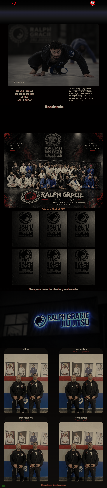

# 🥋 Primata Chubut 023

Sitio web institucional para **Primata Chubut 023 – Ralph Gracie Jiu Jitsu**, una academia de Brazilian Jiu Jitsu.

El proyecto fue desarrollado con un enfoque **Mobile First**, utilizando HTML, Sass y Vite, con una estructura organizada por componentes, layouts, variables y mixins reutilizables.

---

## 📌 Sobre el proyecto

El sitio presenta información de la academia, sus horarios de entrenamiento, profesores y formas de contacto.

### Secciones principales

* 🏠 Inicio
* 🥋 Academia
* 🕐 Horarios de entrenamiento
* 👨‍🏫 Profesores
* 📍 Ubicación
* 📱 Redes sociales
* 💬 Contacto / WhatsApp

---

## 🖥️ Vista previa

### Página principal



---

## 🚀 Demo online

El proyecto se encuentra desplegado en Vercel:

🔗 **[Ver sitio online](PEGAR-AQUI-LINK-DE-VERCEL)**

---

## 📂 Capturas

Las capturas utilizadas en este README se encuentran dentro de:

```text
screenshots/
└── primata-chubut-preview.png
```


## 🛠️ Tecnologías utilizadas

* HTML5
* Sass / SCSS
* Vite
* pnpm
* CSS3
* Git
* GitHub

---

## 📐 Características del desarrollo

### Mobile First

El diseño comienza desde dispositivos móviles y se adapta progresivamente a:

* 📱 Mobile
* 📲 Tablet
* 💻 Desktop
* 🖥️ Desktop XL

Se utilizan media queries mediante mixins de Sass para organizar los distintos breakpoints.

---

### 🎨 Sass

El proyecto utiliza Sass para organizar y reutilizar estilos.

Se trabaja con:

* Variables
* Mixins
* `@use`
* `@forward`
* Nesting
* Media queries reutilizables

Los mixins permiten centralizar comportamientos repetidos como:

* Hover de logos
* Hover de enlaces
* Líneas animadas
* Sombras de títulos
* Botones
* Tarjetas
* Efectos de despliegue
* Breakpoints responsive

---

## 📂 Estructura del proyecto

```text
Academia/
│
├── public/
│   └── img/
│       ├── imágenes del sitio
│       └── iconos
│
├── src/
│   │
│   ├── abstracts/
│   │   ├── _variables.scss
│   │   ├── _mixins.scss
│   │   └── _index.scss
│   │
│   ├── base/
│   │   └── estilos base y reset
│   │
│   ├── components/
│   │   └── componentes reutilizables
│   │
│   ├── layout/
│   │   ├── _header.scss
│   │   ├── _main.scss
│   │   ├── _footer.scss
│   │   └── _index.scss
│   │
│   ├── style.scss
│   └── main.js
│
├── index.html
├── package.json
├── pnpm-lock.yaml
└── README.md
```

> La estructura puede variar ligeramente según la organización final del proyecto.

---

## 🧩 Organización de Sass

El proyecto utiliza `@use` para importar módulos y `@forward` para centralizar archivos.

### `@use`

Se utiliza para acceder a variables y mixins desde otros archivos.

Ejemplo:

```scss
@use '../abstracts/mixins';
@use '../abstracts/variables';
```

### `@forward`

Se utiliza para centralizar módulos dentro de un archivo índice.

Ejemplo:

```scss
@forward './header';
@forward './main';
@forward './footer';
```

---

## 🎯 Efectos e interacciones

El sitio incorpora diferentes efectos visuales mediante CSS y Sass.

### Hover

Los elementos interactivos cuentan con transiciones para:

* Escalado de imágenes y logos
* Cambio de color
* Bordes
* Líneas animadas
* Botones

### Despliegue de información

Las tarjetas de horarios y profesores utilizan un mixin reutilizable para mostrar información mediante:

* `opacity`
* `max-height`
* `transform`
* `transition`

Esto permite reutilizar el mismo comportamiento en diferentes componentes.

---

## 📱 Menú responsive

El menú de navegación móvil utiliza un checkbox para controlar su apertura y cierre sin depender de JavaScript.

La interacción utiliza:

```text
checkbox
   ↓
:checked
   ↓
menú visible
   ↓
opacity + visibility + transform
```

---

## 📍 Ubicación

El sitio incluye un enlace hacia la ubicación de la academia mediante Google Maps.

El usuario puede acceder directamente a la ubicación desde la sección principal.

---

## 🚀 Instalación

Para ejecutar el proyecto localmente:

### 1. Clonar el repositorio

```bash
git clone https://github.com/JorgeCao-lab/Academia.git
```

### 2. Entrar al proyecto

```bash
cd Academia
```

### 3. Instalar dependencias

```bash
pnpm install
```

### 4. Ejecutar el servidor de desarrollo

```bash
pnpm dev
```

Vite iniciará el servidor local para visualizar el proyecto.

---

## 📦 Build para producción

Para generar la versión optimizada:

```bash
pnpm build
```

Para comprobar localmente la versión de producción:

```bash
pnpm preview
```

---

## 🎓 Objetivo del proyecto

Este proyecto forma parte del proceso de aprendizaje y práctica de desarrollo web.

El objetivo principal fue aplicar conocimientos de:

* HTML semántico
* CSS
* Sass
* Arquitectura de estilos
* Diseño responsive
* Mobile First
* Vite
* Organización de proyectos
* Git y GitHub
* Reutilización mediante mixins
* Diseño de interfaces

---

## 👨‍💻 Autor

**Jorge Cao**

Desarrollador en formación Full Stack.

GitHub:
https://github.com/JorgeCao-lab

---

## 📄 Licencia

Este proyecto fue desarrollado con fines educativos y de portfolio.
